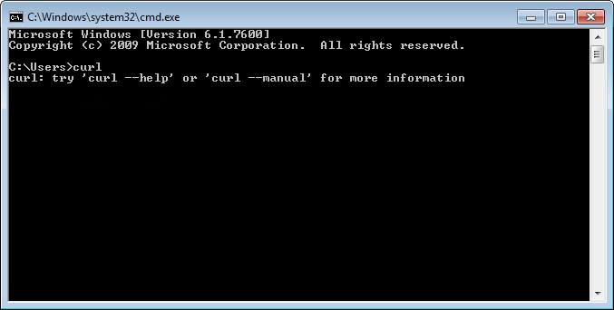

# Periodismo de datos. Anuncios y tarea.

# Matrícula
Hemos notado que varios amixers están tomándose este curso uterino de Periodismo
de Datos en serio. Este blog siempre ha sido serio, pero hemos decidido hacer
el curso algo más formal.

Por eso anunciamos que, **como parte
de las vacaciones útiles 2014, están abiertas las matrículas a este curso!**

Matricúlate llenando este formulario en [Google Forms](https://docs.google.com/forms/d/1nrG7ot6NsSPzkb-LQkil3gCm8o6H-vJEYDzww5_oe-Y/viewform) y al final
del curso puedes tramitar un certificado! Tranquilo(a) que el certificado no será
emitido por ninguna universidad medio pelo. Será emitido por el blog medio pelo
Útero de Marita.

Para recibir el certificado es necesario hacer la tarea. Se emitirá certificado
a los alumnos más aplicados. Es decir a los que hacen la tarea y acumulen más puntaje.

# Quiz 1

**Pregunta:** 
Si pensabas que el Congreso peruano sólo sirve para producir escándalos y titulares
policiales, estabas equivocado! Por ejemplo, nuestro Congreso dedica parte de
su tiempo a enviar saludos. Es tan respetuoso y
atento que a diario se discute como "moción de orden del día" **enviar saludos a diversas
instituciones, personalidades, pueblos, distritos**, etc.

Todos los saludos de esta legislatura están colgados en la web del Congreso, en
esta dirección: 
[http://www.congreso.gob.pe/mociones/mocion2011.asp?lg=&CurPage=1](http://www.congreso.gob.pe/mociones/mocion2011.asp?lg=&CurPage=1)

Estas mociones están incluidas en 191 páginas web en total (**al parecer TODO es
saludito saludito**). 
**Tu tarea es
averiguar cuántas mociones del día se emitieron durante el año 2013.**

**HINT 1:** Si usas Linux o Mac, ya tienes instalado cURL (utilizado en el
[capítulo 01](http://aniversarioperu.utero.pe/2013/12/04/periodismo-de-datos-capitulo-01/))
Si usas Windows, te bajas **cURL** para Windows de aquí
[http://www.confusedbycode.com/curl/](http://www.confusedbycode.com/curl/).
De preferencia descarga el instalador de cURL "With Administrator Privileges".
Una vez instalado necesitas abrir una consola (**cmd**) y ejecutar el software tipeando
**cURL**:

**HINT 2:** El uso básico del comando **curl** es el siguiente:

``curl -c cookies.txt -o "#1.html" "http://paginaweb.com/cgi.asp?parametro=[1-100]"``

1. En este caso se usa ``-c cookies.txt`` para guardar los cookies generados
    por la web del Congreso en el archivo cookies.txt
2. ``-o #1.html`` se usa para que caga página descargada (*output*) se grabe en
   el disco duro usando el número del 1 al 100 y con la extensión ``.html``
   (ya que estas son páginas web).
3. En este ejemplo se usa [1-100] porque queremos descargar páginas que incluyan
  el rango:
  
  * http://paginaweb.com?parametro=1
  * http://paginaweb.com?parametro=2
  * http://paginaweb.com?parametro=3
  * ...
  * http://paginaweb.com?parametro=100
 

**HINT 3:**
Si usas Linux o Mac OSX ya tienes instalado el comando **grep** reseñado en el
[capítulo 02](http://aniversarioperu.utero.pe/2013/12/18/periodismo-de-datos-capitulo-02/)

Si usas Windows te descargas el programa de esta dirección: 
[http://downloads.sourceforge.net/gnuwin32/grep-2.5.4-setup.exe](http://downloads.sourceforge.net/gnuwin32/grep-2.5.4-setup.exe)
Lo instalas, abres un terminal o consola de comandos (**cmd**) y tipeas algo
parecido para ejecutar el comando ``grep``:

``"c:\Program Files\GnuWin32\bin\grep.exe" -c saludito *.html``

1. El parámetro ``-c saludito`` sirve para contar cuántas veces la palabra
   ``saludito`` aparece en cada archivo guardado en tu carpeta local.
2. El parámetro ``*.html`` se asegura que la búsqueda se realice sólo en los
   archivos que tengan la extensión ``.html``.

# Envío de respuestas
Me puedes enviar tu respuesta por email, twitter o facebook. Pero si pones
tus respuestas como comentarios a este post tendrás puntos extras! y más puntos
extras si incluyes el procedimiento que utilizaste.

En el post de la siguiente semana publicaré la respuesta a este quiz.
