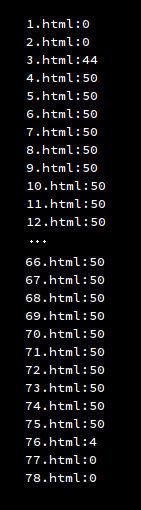
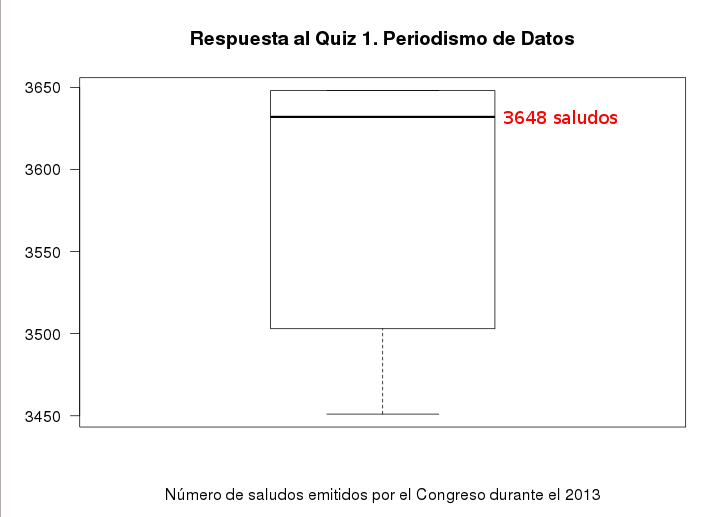

# Periodismo de Datos. Capítulo 05

Agradezco las respuestas al quiz enviadas por los amixers incritos al curso.
**Tenemos la asombrosa cantidad de 33 incritos al curso**, de varias y diversas profesiones!

En el formulario de inscripción ([llénala
        aquí](https://docs.google.com/forms/d/1nrG7ot6NsSPzkb-LQkil3gCm8o6H-vJEYDzww5_oe-Y/viewform))
había un campo opcional donde podías poner qué cosas esperabas aprender en este
curso.

Esta información me será muy útil porque ya tengo una idea de cómo dirigir el curso.
Aquí somos democráticos y ofrecemos lo que la gente pide!

Quedó pendiente dar la respuestas al Quiz/Tarea de la semana pasada en el
[Capítulo 04 de este curso uterino](http://aniversarioperu.utero.pe/2014/01/02/periodismo-de-datos-capitulo-04/).

Sí, ya hay cuatro capítulos anteriores. Si recién llegas al curso, apúrate y
ponte al día!

* [Capítulo 01](http://aniversarioperu.utero.pe/2013/12/04/periodismo-de-datos-capitulo-01/): Aprendemos a usar el comando **cURL**.
* [Capítulo 02](http://aniversarioperu.utero.pe/2013/12/18/periodismo-de-datos-capitulo-02/): Usando el comando **grep* para encontrar nombres de narcoindultados.
* [Capítulo 03](http://aniversarioperu.utero.pe/2013/12/27/periodismo-de-datos-capitulo-03/): Procesamiento de PDFs usando **OCR**.
* [Capítulo 04](http://aniversarioperu.utero.pe/2014/01/02/periodismo-de-datos-capitulo-04/): Incripciones y Quiz/Tarea.

# Respuesta a la tarea

La tarea consistía en averiguar cuántos saludos envió el Congreso peruano
durante el 2013. La lista de saludos emitidas entre los años 2011-2014 están
colgados en esta web
[http://www.congreso.gob.pe/mociones/mocion2011.asp?lg=&CurPage=1](http://www.congreso.gob.pe/mociones/mocion2011.asp?lg=&CurPage=1).

Había que usar los conceptos obtenidos en este curso para hacer el conteo de
saludos.

Si asumimos que todas las mociones del orden del día que aparecen colgadas son
en realidad "saludos", podemos contar el número de mociones que aparecen
listadas en cada página.

Si vemos en detalle las páginas vemos que hay un patrón común, las fechas de
cada orden del día aparecen de forma consistente. Por ejemplo:

> 09/12/2013 

Como cada moción está fechada. Podemos usar la fecha como indicador del número de
mociones. Y si contamos el número de veces que aparece **/2013** en las páginas
sabremos el número de mociones que consisten en **saludito saludito**.

Pero! hay que tomar en cuenta que este texto, **/2013**, puede aparecer en el
título de la moción. Por ejemplo **ley 3030/2013-PE**:

> ... del debate del proyecto de ley 3030/2013-PE y, por consiguiente,
    perturbaron ...

# Solución sofisticada
Si queremos una solución sofisticada tendríamos que ver el código HTML de las
páginas y darnos cuenta que las fechas siempre van entre los *tags*
**``<td></td>``**.

Entonces tendríamos que contar el número de veces que aparece el texto
**``/2013</td>``** en las páginas.

> ``grep -i -c '/2013</td>' *.html``

# Solución ingeniosa
Varios amixers mencionan que la primera página que contiene saludos es la
número 2 y la última es la número 75.
Ya que cada página tiene exactamente 50 entradas solo habría que multiplicar
este número por (75 - 3) y sumarle el número de saludos en las páginas 2 y 75.

Usando el comando **grep** puedes averiguar que la página número 2 tiene 44
saludos y la página 75 tiene solo 4.

Entonces el número total de saludos sería ``(75 - 3)*50 + 44 + 4 = 3648``.

# Solución simple pero más laboriosa
Otros amixers me cuentan que usaron el comando **grep** para obtener el número
de mociones por archivo y exportaron la información al programa Excel para
hacer la suma.

Usando el comando **grep**:

> ``grep -c '/2013</td>' *html``

Si haces la suma tendrás el total de **3648** saluditos.

# Solución aproximada
Otros amixers decidieron contar el número de palabras que contienen cualquiera
de las "Saludo, Saluda y Saludar".

Para esto usaron el siguiente comando **grep**:

> grep -c 'salud' *html

Esta solución es válida, pero te da un número aproximado porque hay mociones
que no incluyen las palabras "**Salud**xx" pero también pueden ser consideradas
como saludos. Por ejemplo estos saludos:

 * Saluda por celebrarse el 23 de noviembre el 51º aniversario de edición Correo Huancayo
 * Expresar especial reconocimiento a la Academia Pre Universitaria "Ingeniería"
 * Felicitar a la empresa Compañía e Inversiones FORLI, por conmemorar su 13º aniversario de fundación
 * Rendir homenaje a la Cámara de Comercio, Industria y Turismo de Ucayali
 
# Cuál es la respuesta
Como todo en la vida, nada es blanco y negro. Todos es en tono de grises. Si
consideras que todas las mociones son saludos debes haber obtenido 3648
saludos durante el 2013. Si consideras que sólo son saludos aquellas mociones
que includen las palabras "Saludar, Saluda o Saludo" deberías obtener un poco
menos.

He ploteado los resultados enviados por los amixers inscritos al curso y este
es el consenso de sus respuestas:

Sería chevere si repites el ejercicio y ves si te sale el resultado obtenido
por tus compañeritos de curso.

La próxima semana seguiremos con el curso con otro tema que te encantará.
