# Periodismo de Datos. Capítulo 06

# Cuál congresista ha emitido mayor número de saludos oficiales?

La semana pasada ([capítulo 05](http://aniversarioperu.utero.pe/2014/01/10/periodismo-de-datos-capitulo-05/))
averiguamos que **el Congreso peruano ha emitido 3648** saludos oficiales durante
el año 2013.

Creo que se puede sacar un poco más de jugo a los **saluditos saluditos
oficiales** y hacer un ranking de los congresistas que más saludan para
averiguar cuál de tus congresistas ha sido el que ha firmado
mayor número de saludos.

# Hagamos el ejercicio
La lista de saludos emitidos entre los años 2011-2014 están colgados en esta
web:

[http://www.congreso.gob.pe/mociones/mocion2011.asp?lg=&CurPage=1](http://www.congreso.gob.pe/mociones/mocion2011.asp?lg=&CurPage=1)

[Recuerda que habíamos
usado](http://aniversarioperu.utero.pe/2014/01/02/periodismo-de-datos-capitulo-04/)
el comando **curl** para descargar todas las páginas web en formato .HTML que
contienen los saludos (**alrededor del 99% son saludos oficiales**).

Si te fijas en el código de cada archivo .HTML (usando algún programa que sea
editor de texto) verás que todos los autores de cada moción de orden del día están dentro de los *tags*:

> ``<td width=150 class='menu1' align='left' valign='top'></td>``

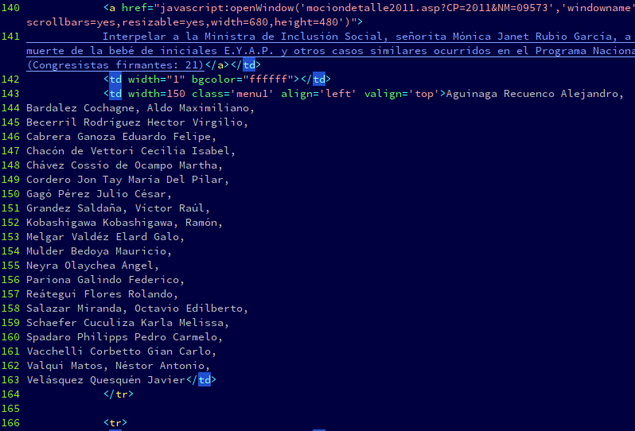

Usando comandos de Linux se puede extaer sólo los nombres de los congresistas
que han sido autores de las mociones.

Este es el comando que he usado:

> ``awk "/150 class='menu1'/,/<\/td>/" *html | sed -r "s/<td.+top'>//g" | sed -r 's/<\/td>//g' | sed -r 's/\s+/ /g' > congresistas.txt``

La explicación de estos comandos queda para un posterior Curso de Periodismo de
Datos **nivel Avanzado**.

Bueno, de aquí te bajas la lista de congresistas. Te darás cuenta que hay
nombres que se repiten. Como cada nombre solo puede figurar una sola vez en
cada saludo oficial. **Se puede contar el número de veces que se repite cada
nombre en la lista para saber cuántas veces cada congresista ha sido autor de
una moción de saludo**.

También te darás cuenta que los nombres no están escritos de manera consitente.
En el caso de apellidos compuestos a veces aparecen con mayúsculas o
minúsculas. Por ejemplo:

* Merino ***de*** Lama Manuel Arturo
* Merino ***De*** Lama Manuel Arturo

A veces los nombres no están completos:

* Rimarachin Cabrera Jorge
* Rimarachin Cabrera Jorge ***Antonio***

# Tarea para la casa
Tu tarea es **refinar** y "**limpiar**" estos datos. Es decir debes asegurarte
el nombre de cada congresista esté escrito de manera consistente en la lista
que te acabas de descargar. Una vez que todos los nombres están escritos de
manera idéntica podemos hacer un ranking de congresistas.

# Haciendo la tarea con Open Refine
[OpenRefine](http://openrefine.org/), antes se llamaba Google Refine, es una
herramienta gratuita (y *open source*) que te permite limpiar y refinar gran
cantidad de datos de manera muy rápida, fácil e intuitiva.

En OpenRefine puedes limpiar, transformar, reconciliar los datos (incluso se
puede relacionar la información con bases de datos externas). Fíjate en los
[videos introductorios en la web de OpenRefine](http://openrefine.org/) para
que veas el potencial de esta herramienta.

[Si descargas el programa y lo instalas en tu computadora](http://openrefine.org/download.html) 
puedes importar en OpenRefine la lista de congresistas que te he proporcionado
en este link.

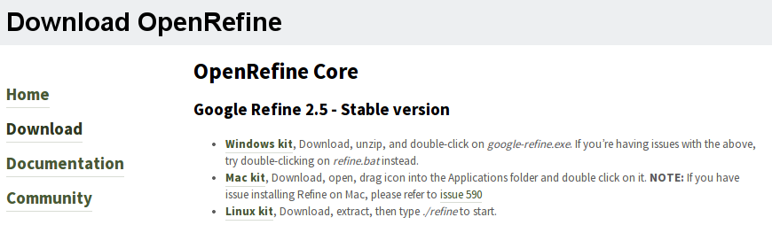

Es posible que tengas que instalar JAVA para que te funcione OpenRefine.
Si es así, debes instalar JAVA, con confianza, aprovecha que es gratis.

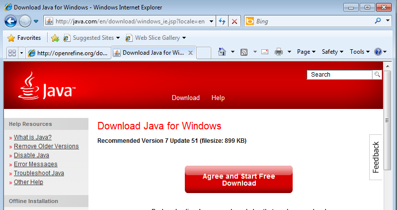

OpenRefine es un programa peculiar ya que funciona usando un *web-browser*. Al hacer
"doble-click" en su archivo ejecutable se abrirá tu navegador de Internet y ya
podrás empezar a usar el programa.

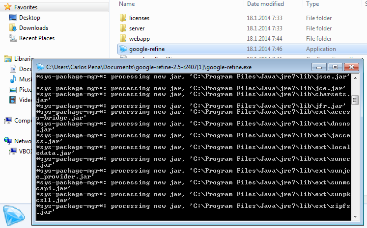

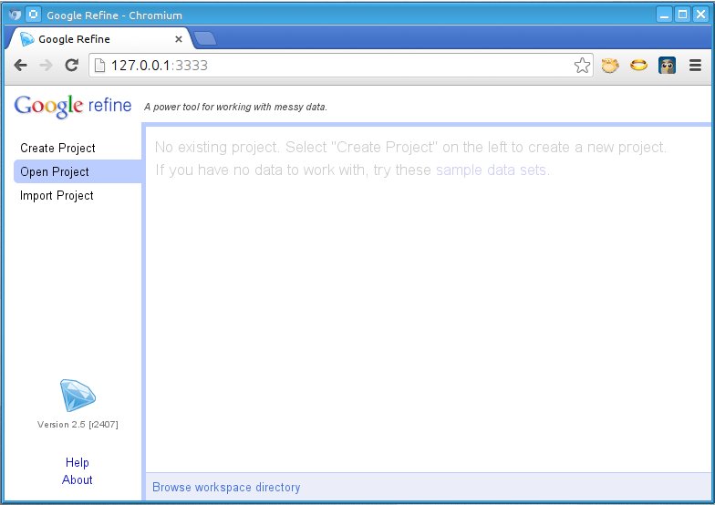

Para importar los datos necesitas hacer click en **"Create Project"** y abrir
el archivo **congresistas.txt**. Click en **Next**.

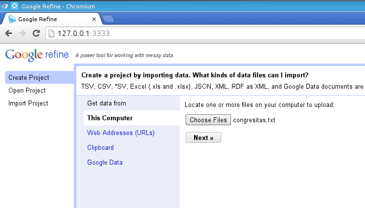

Asegúrate que en el campo **Character encoding** figure **ISO-8859-1**.

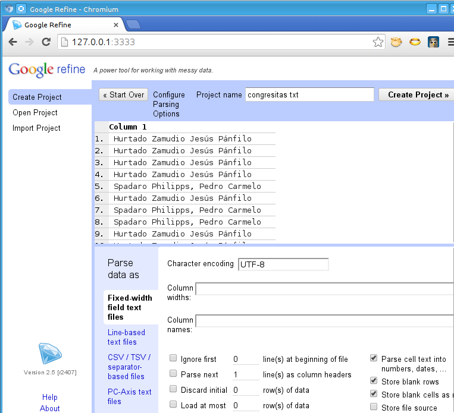

Luego solo basta hacer click en **Create Project** para 
comenzar con la limpieza de datos. Para esto necesitamos
crear un "**Text facet**" para hacer un primer filtro 
de los nombres de tus congresistas.

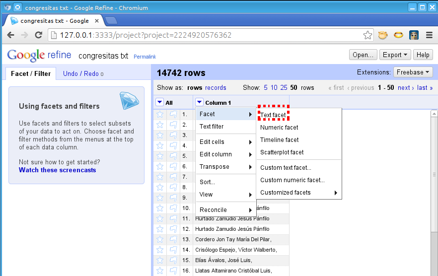

Por ejemplo, la Congresista **Ana María Solórzano**
tiene hasta 7 versiones de su nombre, las cuales deben ser
fusionadas haciendo click en el botón **Cluster**.

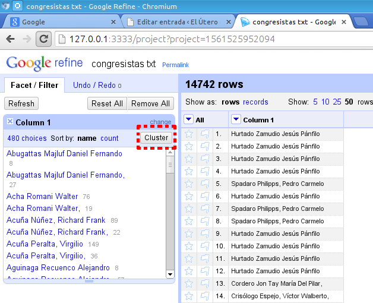

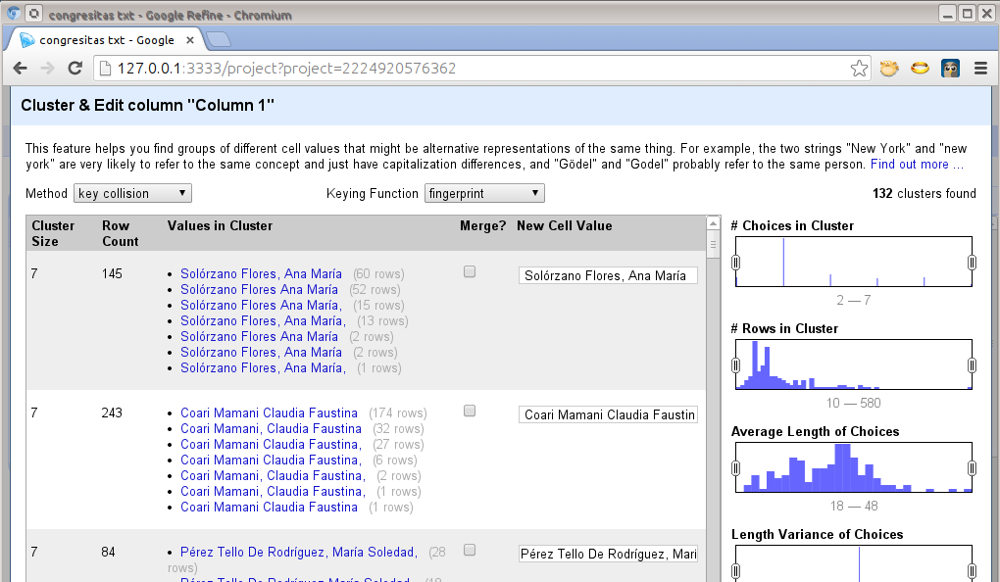

Seleccionas los **cluster** que quieres
fusionar y haces click en el botón
**Merge Selected & Re-cluster** para homogenizar los datos.

Una vez que tienes tu lista limpiecita puedes hacer un ranking rápido del
número de veces que se repite cada nombre. Lo puedes hacer en OpenRefine si
haces el ordenamiento de datos según "**count**".

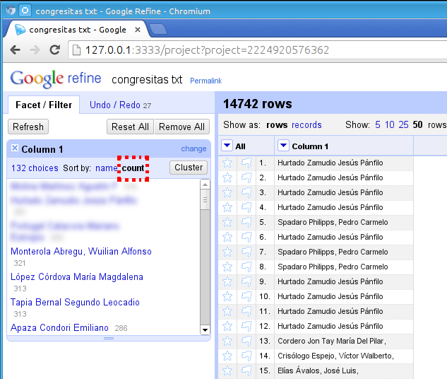

Tu tarea para la casa es averiguar **cuál de los congresistas aparece el mayor
número de veces en la lista** y además **cuántos saluditos saluditos oficiales
ha enviado**.
