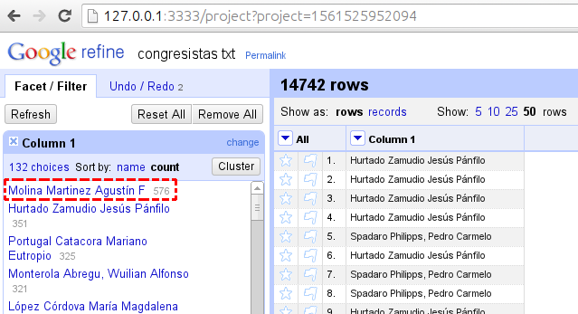
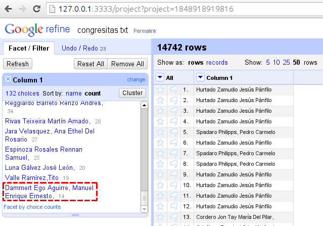
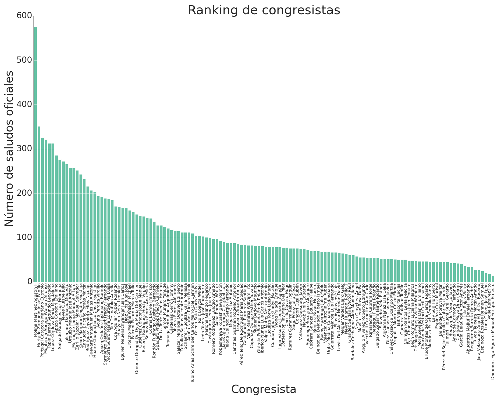
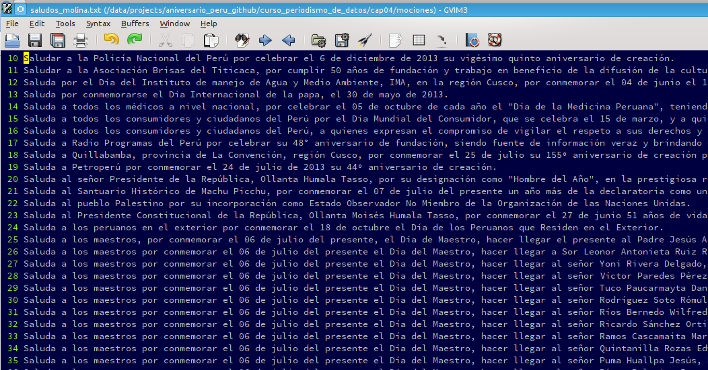

# Periodismo de Datos. Capítulo 07

# Cuál congresista ha emitido mayor número de saludos oficiales?

En el capítulo anterior de este curso uterino ([capítulo 06](http://aniversarioperu.utero.pe/2014/01/18/periodismo-de-datos-capitulo-06/))
dejé como tarea averiguar cuál de tus congresistas había firmado la mayor y
menor cantidad de saludos oficiales en lo que va este gobierno.

Habíamos descargado los datos de los servidores del congreso (alrededor de 191
páginas) y la tarea era limpiar y normalizar los nombres de los congresistas
usando la herramienta [OpenRefine](http://openrefine.org/).

Gracias a los amixers por enviar sus respuestas. Por voto unánime, los
resultados son los siguientes:

* Congresista que emitió **mayor** número de saludos oficiales: **Agustín Molina
  Martínez**, [congresista por el Partido Nacionalista Peruano](http://www.congreso.gob.pe/congresista/2011/amolina/cargos.asp).
  Se lleva el trofeo al haber firmado **576 saludos oficiales** en el lapso
  2011-2014. Felicitaciones!

* Congresista que emitió **menor** número de saludos oficiales: **Manuel Dammert
  Ego Aguirre**, [congresista por el partido ... (tiene partido?)](http://www.congreso.gob.pe/pvp/2011/mdammert.asp),
  quien sólo ha firmado **14 saludos oficiales** hasta el momento.

[Aquí está la lista completa](http://pastebin.com/download.php?i=adJ20W81) de congresistas con el respectivo número de saludos
oficales emitidos por cada uno. Te puedes bajar la lista e importarla a Excel
o tu programa estadístico favorito para hacer un gráfico.

Aquí te muestro un gráfico que hice usando el lenguaje de programación Python y
la librería científica matplotlib (click para ampliar).

Aquí está el código usado para generar ese gráfico
<https://gist.github.com/aniversarioperu/8753160>.

# Interrogantes
Todo este ejercicio me ha dejado preguntando, porqué el congresita Agustín
Molina ha enviado casi 600 saludos oficiales? **Sería interesante averiguar a
quién van dirigidos esos saludos**. Son para empresas? personalidades? persona
natural? autoridades electas?

Podemos extaer la lista de saludos emitidos por el congresista Molina de las
páginas web que hemos descargado con el comando **curl** 
([ver capítulo 04](http://aniversarioperu.utero.pe/2014/01/02/periodismo-de-datos-capitulo-04/)).
Podríamos preguntarle al congresista cuál es su motivación para saludar tanto?

Usando el lenguaje de programación Python hice un script de 15 líneas para
extraer los títulos de cada saludos oficial donde haya estado involucrado el
congresista Agustín Molina:

> # -*- coding: utf-8 -*-
  from bs4 import BeautifulSoup
  import codecs
  import glob
  for filename in glob.glob("*html"):
      f = codecs.open(filename, "r", "latin1")
      html_doc = f.read()
      f.close()
      soup = BeautifulSoup(html_doc)
      for tag in soup.find_all("td", width="150"):
          if 'Molina' in tag.text:
              prev = tag.previous_element
              prev2 = prev.previous_element
              prev3 = prev2.previous_element
              print prev3.previous_element.encode("utf8")

Y te puedes bajar la lista completa de aquí: <http://pastebin.com/3SFwAmVA>

Aquí un preview de la lista de saludos:

# Tarea para la casa
Averiguar si hay algo picante de interés periodístico en la lista de saludos
oficiales firmados por el congresista Agustín Molina.
