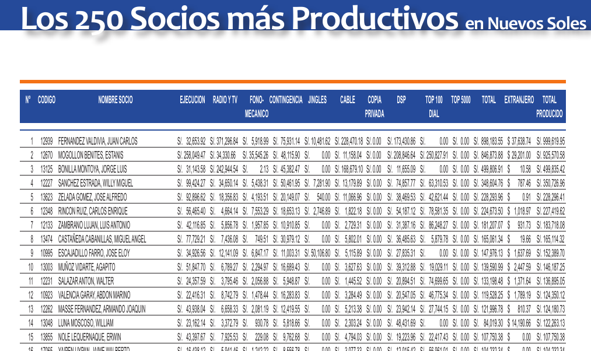

# Periodismo de Datos. Capítulo 08

En el [capítulo anterior de este curso uterino](http://aniversarioperu.utero.pe/2014/02/01/periodismo-de-datos-capitulo-07/)
había extraído la lista de saludos oficiales firmadas por el congresista
Agustín Molina. La lista tenía 576 saludos (pero el
[amixer rulo37 fue el primero en darse cuenta](http://aniversarioperu.utero.pe/2014/02/01/periodismo-de-datos-capitulo-07/?fb_comment_id=fbc_1490203904539608_366974_1490478144512184#f10b1978d8)
que dentro de la lista hay 20 que no son exactamente saludos!).

Había dejado como tarea averiguar si había algo picante o noticioso en la lista
de saludos del congresista Molina. Uno de los alumnitos de este curso me dice
que ha profundizado la investigación y que ha preparado una nota periodística!
Incluyendo una entrevista al único, al mismísimo congresista Agustín Molina!

Todos sintonicen hoy día domingo 9 de Febrero el programa Sin Medias Tintas del
canal 2, Frecuencia Latina, a las 11:00am. Por internet en esta dirección web:
[TV en Vivo](http://www.frecuencialatina.com/tvenvivo/pc). Allí saldrá un
reportaje del amixer [@jsudaka](https://twitter.com/jsudaka).

# Usando Tabula para tabular datos
Agárrense fuerte a sus asientos que hace unos días el uterope 
[ha anunciado](http://utero.pe/2014/02/05/cuanto-y-por-que-le-pago-apdayc-a-koky-bonilla/) la
**segunda temporada de tu serie favorita
[#intervenganAPDAYC](http://utero.pe/category/noticias/denuncia/intervenganapdayc/)**.

Durante la primera temporada de #intervenganAPDAYC hicimos varios gráficos,
[cuadros estadísticos, infografías](http://utero.pe/2013/10/08/la-hora-del-99/)
y [bases de datos](http://utero.pe/selallevan/) que dependían de un detalle
crucial: **haber tabulado el reporte financiero de APDAYC del año
2012**. Era necesario procesar los montos de dinero recibido por cada socio ya
sea en las categorías de regalías, premios, joyas, rentas, bonos, escolaridad,
etc, etc.

Toda esta información está disponible en la [Memoria APDAYC 2012](http://www.scribd.com/doc/135740127/Memoria-Apdayc-2012)
en un archivo PDF que contiene texto e imágenes.

Extraer esos datos hacia una hoja de cálculo es complicado, ya que un
copy/paste de datos en filas y columnas no siempre funciona bien.

Una herramienta que te facilita este tipo de trabajos es la muy buena
aplicación llamada **Tabula** [http://tabula.nerdpower.org/](http://tabula.nerdpower.org/).

Tabula es **"una herramienta para liberar datos en tablas que están atrapados dentro
de archivos PDF"**.
Tabula ha sido creada por el gran [Manuel Aristarán](http://jazzido.com/) con
la ayuda de ProPublica, La Nación DATA y Knight-Mozilla OpenNews.

Descargas Tabula desde aquí <http://tabula.nerdpower.org/> y está disponible
para Windows, Mac OS y Linux. También necesitas haber instalado Java.

Tabula es fácil de usar, cargas el PDF de interés y seleccionas con un
rectángulo la tabla que contenga los datos a extraer y listo. Puedes descargar
los datos extraídos en un archivo CSV que puede ser importado a MS Excel o
cualquier programa estadístico.

Aquí hay un vídeo demostrando el procedimiento:
<https://erika.makes.org/popcorn/16ll>

ps. gracias a [Antonio Cuga](https://twitter.com/antoniocuga) por el dato.

## TL,DR
Si quieres tabular datos contenidos en un PDF, **Tabula** usar debes.

