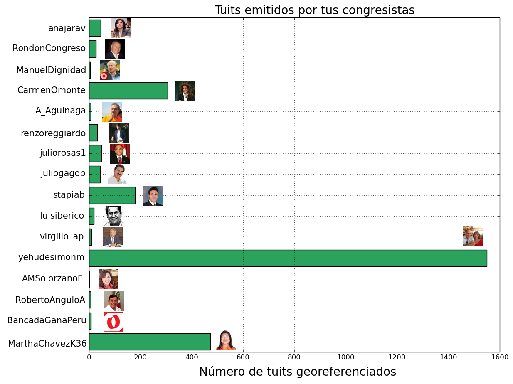
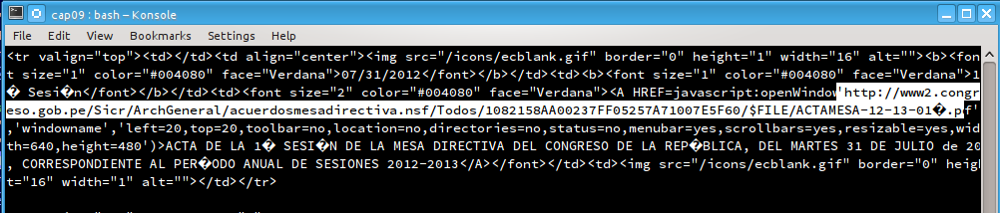

# Periodismo de Datos. Capítulo 09

## Fiscalizando los viajes de los congresistas via twitter
En un [post reciente](http://aniversarioperu.utero.pe/2014/02/11/vigilando-las-carceles-del-peru-desde-twitter/)
de este blog uterino, describí un método para crear un
twitter bot que vigile si habían tuits que salen desde alguna de las prisiones
del territorio peruano.

Este twitter bot se llama [@ArturitoBot](https://twitter.com/arturitobot). La
principal función de @ArturitoBot es vigilar las cárceles del Perú. Pero le
fabriqué una herramientas adicional para que me haga el favor de descargar los
3200 tuits más recientes y georeferenciados de todos nuestros congresistas de
la república.

Luego de un rato, [@ArturitoBot](https://twitter.com/arturitobot) me entregó
los resultados (grande Artu!). La gran mayoría de congresistas tiene una cuenta
en tuiter, y sólo unos pocos tienen activada la función de emitir tuits con
coordenadas geográficas. No nos cansaremos de repetir que no es bueno hacer
pública este tipo de información, si lo haces puedes ser presa de 
[acosadores](http://hack.utero.pe/2014/02/03/un-usuario-de-twitter-podria-ser-victima-de-acoso/) y
[marcas](http://aniversarioperu.utero.pe/2014/02/04/haciendo-reglaje-a-usuario-de-twitter/).

Aquí la lista de congresistas que tuitean con coordenadas geográficas:

Se me ocurrió colocar todos los tuits en un Google Map para visualizar mejor
los resultados.

Hay algunos tuits interesantes. Por ejemplo la congresista Carmen Omonte, del
partido Perú Posible, tuiteando desde la Isla de Pascua 
([aquí el tuit](https://twitter.com/carmenomonte/status/317731002325811201)). El congresista Segundo
Tapia, del partido fujimorista, ha tuiteado desde la isla de Taiwán
([tuit original](https://twitter.com/stapiab/status/323816218383486976)).

Si revisas los tuits emitidos desde Santiago de Chile encontrarás que la
congresista Carmen Omonte estuvo tuiteando desde aquella capital entre el 27 de
Marzo y el 14 de Abril 2013:

* 27 de Marzo en Santiago ([ver tuit](https://twitter.com/carmenomonte/status/316941640398942209)).
* 29 de Marzo en la Isla de Pascua ([ver tuit](https://twitter.com/carmenomonte/status/317731002325811201)).
* 14 de Abril en Santiago 4to Encuentro Peruano Chileno: Pensando en el Futuro.
  Organizado por Fundacion Chile 21 ([ver tuit](https://twitter.com/carmenomonte/status/323253641911865344)).

Por lo general, los congresistas viajan al extranjero con los pasajes y
viáticos pagados con los impuestos de todos los peruanos. Entonces podemos hacer un
ejercicio de fiscalización y tratar de averiguar si la congresista Carmen
Omonte tramitó permiso para el Encuentro Peruano-Chileno y uno o dos días extra
para poder visitar la Isla de Pascua. Sería muy penoso encontrar que la
congresista solo pidió permiso para asistir en función oficial pero se dio una
escapadita a la famosa isla.

También es curioso que al día siguiente de estar en Santiago de Chile, la
congresista comenzó una serie de tuits desde Madrid, España:

* 15 Abril 2013 ([ver tuit](https://twitter.com/carmenomonte/status/323653777573945344)).
* 16 Abril 2013 ([ver tuit](https://twitter.com/carmenomonte/status/324260683061534722)).
* 18 Abril 2013 ([ver tuit](https://twitter.com/carmenomonte/status/324939467284684801)).
* 20 Abril 2013 ([ver tuit](https://twitter.com/carmenomonte/status/325531064036642816)).

# Usando las TIC
Podemos usar las técnicas de periodismo de datos para averiguar cuáles fueron
las fechas que la congresista estuvo autorizada para viajar al extranjero en
funciones oficiales.

Todas los acuerdos de la mesa directiva del congreso están en el 
[portal del Congreso](http://www2.congreso.gob.pe/sicr/ArchGeneral/acuerdosmesadirectiva.nsf/todos?OpenView&Start=1&Count=100&Expand=1).
Y [en esta página](http://www2.congreso.gob.pe/sicr/ArchGeneral/acuerdosmesadirectiva.nsf/todos?OpenView&Start=1&Count=100&Expand=2)
están los acuerdos entre Julio 2012 a Julio del 2013. Allí se
deben encontrar las autorizaciones a la congresista Omonte.

Es posible descargar manualmente cada uno de los archivos PDF conteniendo los acuerdos de
mesa en búsqueda de los permisos de viaje otorgados a cada congresista. Pero
podemos acelerar la búsqueda si usamos las **tecnologías de información
y comunicación** disponibles en las computadoras, tales como programas útiles en el procesamiento
de datos, algunos de los cuales ya hemos estudiado en este curso uterino.

Podemos guardar la última página que he mencionado en tu disco duro desde tu
navegador de internet usando CTRL-S, y lo llamamos
``acuerdos_mesa_directiva.html``.

Tal como he mencionado en posts anteriores, los datos del Congreso están
disponibles en la web, pero de la manera más horrible posible. Parece que hacen
un gran esfuerzo en dificultar el minado de datos.

Por ejemplo este archivo HTML tiene una codificación Latin-1, la cual hace que los
caracteres con acentos y caracteres especiales se vean de manera extraña. Esto
es más grave aún ya que el nombre de los archivos PDF, que contienen los
acuerdos de mesa directiva, tienen caracteres
especiales. Obviamente esto ha sido realizado con el único propósito de hacer
renegar a todos los contribuyentes que queremos hacer minado de datos.

Para poder trabajar el archivo hay que convertirlo a una codificación más
conveniente como UTF-8, por ejemplo. En Linux lo puedes hacer con este comando:

> iconv -f ISO-8859-1 -t UTF-8 acuerdos_mesa_directiva.html > out.html

Si no tienes Linux te puedes descargar el archivo resultante desde aquí
<http://pastebin.com/download.php?i=BMGmSEsz>.

Podemos extraer rápidamente los links a cada uno de los PDF (son 70 en total) si usamos una
técnica conocida como ***Regular Expressions***. Esta técnica también se le
conoce como [regex](http://en.wikipedia.org/wiki/Regular_expression) y es 
un mundo aparte en el arte del hacking. Existen 
[libros completos](http://www.amazon.com/Mastering-Regular-Expressions-Jeffrey-Friedl/dp/0596528124)
dedicados al estudio y uso de las *regular expressions*.

Básicamente un *regex* es una serie de símbolos que se usan para representar
patrones de texto. Si usas *regex* puedes extraer rápidamente texto
diferente, si es que tienen un patrón en común. Las *regex* pueden ser muy
simples o muy complejas. Cuenta la leyenda urbana que un hacker escribió un *regex*
tan complicado que su computadora comenzó a sudar sangre.

En nuestro caso, el *regex* que representa los links a los PDF con los
acuerdos de mesa directiva es sencillo y es el siguiente:

> http:\/\/www2.+pdf

Este *regex* trata de representar texto que comience con **"http://www2"** y
termine con **"pdf"**. Usamos este *regex* en combinación con el programa
**awk** para extraer todos los links que necesitamos:

> awk 'match($0, /http:\/\/www2.+pdf/) { print substr($0, RSTART, RLENGTH)}' out.html 

Y este es parte del resultado:

> http://www2.congreso.gob.pe/Sicr/ArchGeneral/acuerdosmesadirectiva.nsf/Todos/61DD93D620A5912F05257A7200595E1D/$FILE/ACTAMESA-12-13-07ª.pdf
> http://www2.congreso.gob.pe/Sicr/ArchGeneral/acuerdosmesadirectiva.nsf/Todos/174811CDCDB0BF0705257A760007998A/$FILE/ACTAMESA-12-13-08ª.pdf
> http://www2.congreso.gob.pe/Sicr/ArchGeneral/acuerdosmesadirectiva.nsf/Todos/E842180F1DEAEF6305257A7200592D03/$FILE/ACTAMESA-12-13-06ª.pdf
> http://www2.congreso.gob.pe/Sicr/ArchGeneral/acuerdosmesadirectiva.nsf/Todos/D557DA48D56944B305257A720007E8BB/$FILE/ACTAMESA-12-13-05ª.pdf
> http://www2.congreso.gob.pe/Sicr/ArchGeneral/acuerdosmesadirectiva.nsf/Todos/D0DDBFAD4C6B184305257A720007CE9D/$FILE/ACTAMESA-12-13-04ª.pdf
> http://www2.congreso.gob.pe/Sicr/ArchGeneral/acuerdosmesadirectiva.nsf/Todos/C929918905F0568E05257A720005C4C4/$FILE/ACTAMESA-12-13-03ª.pdf
> http://www2.congreso.gob.pe/Sicr/ArchGeneral/acuerdosmesadirectiva.nsf/Todos/7D386B7679EB0AEE05257A71007FADD8/$FILE/ACTAMESA-12-13-02ª.pdf
> http://www2.congreso.gob.pe/Sicr/ArchGeneral/acuerdosmesadirectiva.nsf/Todos/1082158AA00237FF05257A71007E5F60/$FILE/ACTAMESA-12-13-01ª.pdf

Te puedes bajar la lista de links a los PDF de aquí
<http://pastebin.com/download.php?i=ZAWPK1Ey>

Es la primera vez que veo un superíndice formando parte del nombre de un
archivo en la web. El Congreso no deja de sorprenderme.

Descargar todos esos archivos a partir de la lista de links es muy fácil si
usamos el comando **wget**. Pero ya sabemos que a Bradley Manning lo metieron
preso en parte por [haber descargado archivos usando *wget*](http://www.washingtonpost.com/blogs/worldviews/wp/2013/07/30/the-free-web-program-that-got-bradley-manning-convicted-of-computer-fraud/).
Si usas Linux o Mac OSX ya tienes wget instalado en tu computadora. Si usas
Windows lo puedes instalar desde aquí
<http://gnuwin32.sourceforge.net/packages/wget.htm>

Ya que no queremos que a ti te pase lo mismo, mejor utilizaremos el comando
**curl** para hacer la descarga.

En posts anteriores hemos visto el comando **curl** que nos sirve para
descargar archivos de la web en grandes cantidades
([aqui](http://aniversarioperu.utero.pe/2013/12/04/periodismo-de-datos-capitulo-01/)
 y [aqui](http://aniversarioperu.utero.pe/2014/01/10/periodismo-de-datos-capitulo-05/)).

**curl** se puede usar para descargar enlaces listados en un archivo siempre y
cuando estén en el siguiente formato:

    url = "http://www.congreso/archivo1.pdf"
    -O
    url = "http://www.congreso/archivo2.pdf"
    -O
    url = "http://www.congreso/archivo3.pdf"
    -O
    url = "http://www.congreso/archivo4.pdf"
    -O
    etc, etc, etc

El parámetro **url** es obvio, y el parámetro **-O** (guión y letra o
        mayúscula) sirve para indicar que el
archivo descargado se deba guardar en el disco local sin alterar el nombre del
archivo.
Supongamos que esta lista está en el archivo **urls.txt**. Corres el programa
usando el siguiente comando:

> curl -K urls.txt

El servidor del congreso es medio chancho y si tienes suerte podrás descargar
todos los archivos al primer intento. Pero lo más probable es que tengas que
intentar varias veces hasta que el servidor del Congreso despierte de su
letargo y empiece a servir archivos.
Es posible que en uno de los intentos puedas bajar algunos de los archivos pero
no todos. Si es así puedes borrar de tu lista aquellos archivos que
descargaste e intentar con **curl** varias veces más hasta que puedas obtener
el resto de archivos.

Es lamentable que el servidor del Congreso esté en esta situación tan precaria.
La lentitud del servidor es notable y evidente cuando visitas su portal. Se
supone que este servidor no debe recibir muchas visitas diarias. Pero a qué se
debe su lentitud? (Es lento incluso ahorita siendo las 3:00a).
Es posible que el servidor esté infectado con algún virus y
se encuentre emitiendo *spam* lo cual hace que su funcionamiento sea taaaaaaan
lento.

Cuando hayas descargado todos los archivos, podemos convertirlos todos a
archivos TXT para hacer una búsqueda de cada congresista usando el comando
**grep**.

Si tienes Linux o Mac OS puedes convetir archivos PDF a TXT con el siguiente
comando:

    ls *pdf | xargs -I {} pdftotext {}

Si usas Windows te puedes descargar los archivos convertidos desde mi dominio
web: <http://horis.me/utero/acuerdos_de_mesa.zip>

# Tarea para la casa

* Una vez que tengas tus archivos TXT en tu carpeta local, debes usar el comando
**grep** para ubicar aquel acuerdo de mesa directiva donde la congresista
Carmen Omonte haya recibido permiso para viajar a España. Una vez que ubicas el
archivo debes leer el contenido y, tomando en cuenta sus tuits desde España
además de fecha y hora de emisión, corroborar si ella se quedó en España durante
el periodo autorizado. 
* Averiguar si los pasajes y viáticos usados por la congresista Carmen Omonte
  salieron de su bolsillo propio o salió de tus impuestos.

SPOILER: muaahhaha.

HINT: El comando *grep* fue explicado en el [Capítulo 5](http://aniversarioperu.utero.pe/2014/01/10/periodismo-de-datos-capitulo-05/) de este curso.

* Averiguar cuales eran las fechas que comprendían la autorización de viaje de
  la congresista Carmen Omonte a Santiago de Chile.

SPOILER: más muaahhaha.

PS. Regreso la próxima semana con las respuestas!

