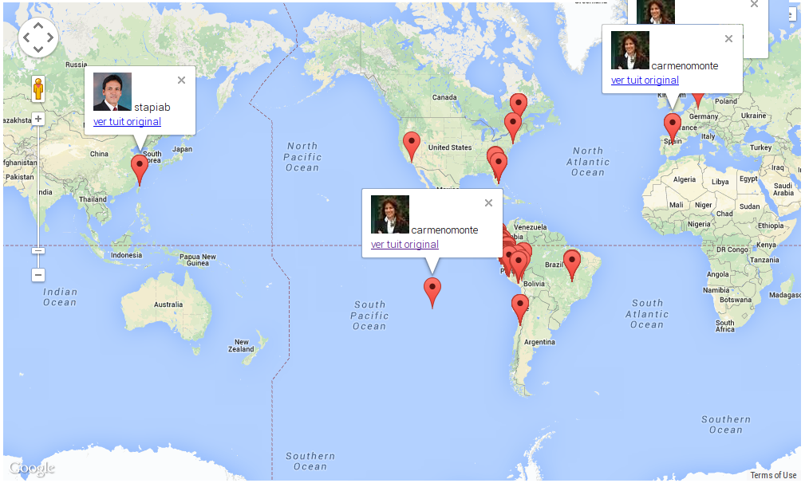

# Periodismo de Datos. Capítulo 10

## Fiscalizando los viajes de los congresistas via twitter
En el [capítulo anterior de este curso](http://aniversarioperu.utero.pe/2014/02/17/periodismo-de-datos-capitulo-09/)
habíamos explorado la posibilidad de fiscalizar los viajes al exterior de los
congresistas de la república.

La mayoría de congresistas usa fondos del estado para financiar sus viajes al
exterior cuando van en misión oficial. Por lo tanto es nuestro derecho y deber
enterarnos si el dinero de nuestros impuestos de gasta (o invierte) de la mejor
manera.

Para este fin había descargado los tuits georeferenciados más recientes de
nuestros congresistas y los había ploteado sobre un Google Map 
([ver el resultado aquí](http://aniversarioperu.me/utero/todos_congresistas.html)).

# Solución a la tarea
Gracias a los amixers que enviaron sus respuestas. Todos estuvieron acertados.

## Estas fueron las preguntas:
Ubicar aquel acuerdo de mesa directiva donde la congresista Carmen Omonte haya recibido permiso para viajar a España.
Corroborar si ella se quedó en España durante el periodo autorizado. Averiguar
si los pasajes y viáticos usados por la congresista Carmen Omonte salieron de
su bolsillo propio o salió de tus impuestos.

Rpta. Tal como lo reportaron ustedes, la autorización para el viaje oficial a
España es la número ACTAMESA-12-13-43a.txt

> 1. Autorizar a la delegación conformada por los Congresistas José León Luna Gálvez,
    Tercer Vicepresidente del Congreso, quien la Presidirá, Luis Fernando Galarreta
    Velarde, Presidente de la Liga Parlamentaria Perú-España, Santiago Gastañadui
    Ramírez, Luz Filomena Salgado Rubianes, **María del Carmen Omonte Durand**, Martín
    Belaunde Moreyra, Luis Carlos Antonio Iberico Núñez y Elías Nicolás Rodríguez
    Zavaleta, para realizar una visita a **Madrid, España, del 15 al 19 de
    abril de 2013**, con la
    finalidad de cumplir una agenda coordinada con el Ministerio de Relaciones Exteriores.
> 2. Disponer que la Dirección General de Administración realice las acciones
    administrativas necesarias a fin de otorgar los pasajes y los viáticos correspondientes,
    debiendo considerar un día antes y un día después del evento, según itinerario y previo
    informe de disponibilidad presupuestal.

Esto coincide con los tuits que la congresista emitió desde Madrid. Todo bien:

[gist id=9177326]

El acuerdo de mesa también menciona que el congreso pagó los gastos de la
comitiva que integró la congresista Omonte. La única excepción fue el
congresista José Luna que pagó el viaje con su plata

> 3. Exceptuar de la adquisición de pasajes y otorgamiento de viáticos al Congresista José
Luna Gálvez, Tercer Vicepresidente del Congreso, según lo dispuesto en el
Memorándum 276-2012-2013/TVP-CR, quien asumirá los gastos que ocasione dicho
viaje.

Averiguar cuáles eran las fechas que comprendían la autorización de viaje de la congresista Carmen Omonte a Santiago de Chile.
