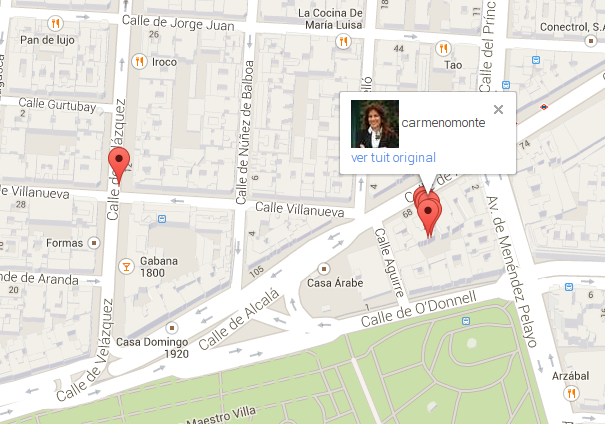

# Periodismo de Datos. Capítulo 11

# Fiscalizando las estadías en hoteles de los congresistas vía twitter
En el [capítulo anterior de este curso](http://aniversarioperu.utero.pe/2014/02/25/periodismo-de-datos-capitulo-10/)
había quedado pendiente explorar la posibilidad de averiguar en qué hoteles se
hospedan los congresistas de la república durante sus viajes oficiales al
extranjero.
Esto es posible ya que algunos congresistas acostumbran tuitear durante sus
viajes usando la opción de emitir tuits conteniendo coordenadas geográficas.

En el [capítulo 9](http://aniversarioperu.utero.pe/2014/02/17/periodismo-de-datos-capitulo-09/)
de este curso mostré un Google Map 
[conteniendo los tuits georeferenciados](http://aniversarioperu.me/utero/todos_congresistas.html)
más recientes de los congresistas más tuiteros.
Al tener esta información de manera gráfica se puede identificar rápidamente
los patrones de tuiteo de tus congresistas.

Habíamos averiguado que la congresista Carmen Omonte estuvo con permiso para
viajar a España del 15 al 19 de abril del 2013. Además el estado peruano pagó
el costo de los pasajes y viáticos de la congresista. Y queríamos averiguar
si ella se había hospedado en hotel lujoso o en hotel misio.

Al combinar la información cosechada de tuiter con la visualización en Google
Maps y las fotografías de las calles de Madrid disponibles en Google Street
View, es posible ver la fachada del hotel que alojó a la congresista en dicho
viaje.

Y tal como lo dice el hacendoso amixer 
[Rul37](http://aniversarioperu.utero.pe/2014/02/25/periodismo-de-datos-capitulo-10/?fb_comment_id=fbc_550523168389102_2952120_550661665041919#ff2ece4dc),
se puede averiguar en TripAdvisor el costo del hospedaje en tal hotel por noche
por persona.

Rul37 dice: 

> Oscila entre 80,16 EUR y 141,75 EUR por noche por persona. Ojo he tomado las
fecha similares al viaje de la congresista ahora ministra. No parecen ser
descabelladas, ahora eso sí falta considerar alimentación, transporte
público... y si de repente no gastan tanto... seguramente el saldo restante se
lo guardar en el bolsillo no? (descontando el precio de los pasajes
        Lima-Madrid-Lima)

El costo de 80 o 90 euros por una noche en un hotel de Madrid suena bastante
razonable.

# Recapitulando este curso
En este curso básico de Periodismo de Datos he tratado de mostrar algunos
*tips* útiles para cosechar, procesar y analizar datos con posibles fines
periodísticos.
Creo que estas herramientas utilizables en el periodismo de datos pueden
dividirse en tres grandes grupos:

* Comandos de Linux como **grep**, **curl**, **awk**, y muchos más.
* Desarrollo de software utilizando algún lenguaje de programación (en este
  curso hemos visto algunas cosas en el lenguaje Python).
* Uso de servicios y aplicaciones web como Google Maps, Google Street View,
  Open Refine, Twitter, etc.

Además creo que existe un mayor potencial de hacer cosas interesantes al combinar
herramientas de los tres grupos mencionados. A pesar que en este curso sólo
hemos arañado la superficie de todo el potencial que estas herramientas te
ofrecen, se ha podido hacer cosas interesantes:

### Narcoindultos
En el [capítulo 2](http://aniversarioperu.utero.pe/2013/12/18/periodismo-de-datos-capitulo-02/)
mostré cómo usar **curl** y **grep** para ubicar rápidamente el indulto firmado
por Aurelio Pastor y Alan García al narcotraficante **VALENZUELA MENESES, EDWIN
JAVIER** que reincidió en las malas artes y fue capturado con las manos en 4
toneladas de droga (le habían rebajado la pena de 12 a 6 años). Este hallazgo
fue de suficiente significancia para aparecer en 
[La República](http://www.larepublica.pe/18-10-2013/detienen-con-droga-a-otro-indultado-por-chinguel).

### Saluditos congresales
En los capítulos [4](http://aniversarioperu.utero.pe/2014/01/02/periodismo-de-datos-capitulo-04/),
[5](http://aniversarioperu.utero.pe/2014/01/10/periodismo-de-datos-capitulo-05/),
[6](http://aniversarioperu.utero.pe/2014/01/18/periodismo-de-datos-capitulo-06/)
y [7](http://aniversarioperu.utero.pe/2014/02/01/periodismo-de-datos-capitulo-07/)
estuvimos haciendo un ranking de los congresistas que han firmado el mayor
número de saludos oficiales. 
Se puedo averiguar que el congresista Agustín Molina firmó 576 saludos en lo
que va de este gobierno. Esto terminó en un reportaje de Jonathan Castro
([ver vídeo](http://www.youtube.com/watch?v=0od2QRKwyQY)) para el programa Sin
Medias Tintas en Frecuencia Latina.

# Curso Periodismo de Datos Avanzado
Creo que el siguiente paso en esta saga educativa sería un "Curso Periodismo de
Datos II" o curso avanzado.

Este curso incluiría cosas básicas como la instalación de un sistema operativo
Linux para poder utilizar toda la gama de comandos útiles en la cosecha y
el procesado de datos. Además se necesitaría incluir un capítulo destinado
solamente a la familiarización de los estudiantes con el entorno Linux y la
temida consola de comandos o terminal. 

Los usuarios de computadoras Mac OSX no tendrían mucho problema con esto ya que
su sistema operativo es muy parecido a los Unix/Linux y comparten la mayoría
de comandos y funciones. Talvez los usuarios de Windows tengan que zapatear un
poquito.

### Aprender programación
Si quieres tener mayores posibilidades y capacidades de procesar datos con
fines periodísticos es muy necesario saber programar. Si eres periodista y no
te vacila entrar en el ámbito de la programación, te convendría bastante tener
de colega en la redacción a un programador.

El saber programar te da todo un abanico de posibilidades para cosechar y
procesar datos. Las [infografías que hice para la saga #intervenganAPDAYC](http://utero.pe/2013/10/08/la-hora-del-99/) 
fueron posibles gracias a que aprendí a programar hace unos años. 
Si te animas a aprender a programar, estás de suerte porque hoy en día hay
numerosas alternativas para ti.

Por ejemplo puedes llevar buenazos cursos gratuitos e interactivos en la web. 
[CodeAcademy](http://www.codecademy.com/es/) es un excelente sitio para
aprender programación. Tiene una interfase muy amigable y ganas una serie de
puntos y medallas conforme progresas (muy estimulante si aprendes en simultáneo
        con un amixer y hacen competencia).
Te recomiendo que escojas un lenguaje de programación que sea fácil, amigable y
muy popular. Creo que Python y/o Ruby son ideales para iniciarse en el arte de la
programación. Puedes escoger cualquiera de los dos.

# Tarea para la casa
Matricularse en [CodeAcademy](http://www.codecademy.com/es/) y hacer las
primeras 2 lecciones de Python o Ruby. Si ves que te gusta este asunto de la
programación, continúas por tu cuenta. Si ves que esto no es lo tuyo, lo dejas nomás.
