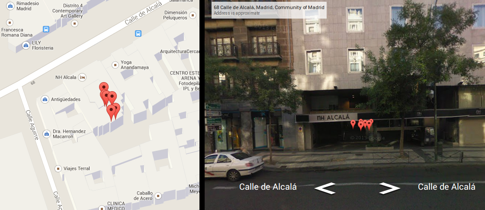

# Periodismo de Datos. Capítulo 11

## Fiscalizando las estadías en hoteles de los congresistas vía twitter
En el [capítulo anterior de este curso](http://aniversarioperu.utero.pe/2014/02/25/periodismo-de-datos-capitulo-10/)
había quedado pendiente explorar la posibilidad de averiguar en qué hoteles se
hospedan los congresistas de la república durante sus viajes oficiales al
extranjero.
Esto es posible ya que algunos congresistas acostumbran tuitear durante sus
viajes usando la opción de emitir tuits conteniendo coordenadas geográficas.

En el [capítulo 9](http://aniversarioperu.utero.pe/2014/02/17/periodismo-de-datos-capitulo-09/)
de este curso mostré un Google Map 
[conteniendo los tuits georeferenciados](http://aniversarioperu.me/utero/todos_congresistas.html)
más recientes de los congresistas más tuiteros.
Al tener esta información de manera gráfica se puede identificar rápidamente
los patrones de tuiteo de tus congresistas.

Habíamos averiguado que la congresista Carmen Omonte estuvo con permiso para
viajar a España del 15 al 19 de abril del 2013. Además el estado peruano pagó
el costo de los pasajes y viáticos de la congresista. Y queríamos averiguar
si ella se había hospedado en hotel lujoso o en hotel misio.

Al combinar la información cosechada de tuiter con la visualización en Google
Maps y las fotografías de las calles de Madrid disponibles en Google Street
View, es posible ver la fachada del hotel que alojó a la congresista en dicho
viaje.

Y tal como lo dice el hacendoso amixer 
[Rul37](http://aniversarioperu.utero.pe/2014/02/25/periodismo-de-datos-capitulo-10/?fb_comment_id=fbc_550523168389102_2952120_550661665041919#ff2ece4dc),
se puede averiguar en TripAdvisor el costo del hospedaje en tal hotel por noche
por persona.

Rul37 dice: 

> Oscila entre 80,16 EUR y 141,75 EUR por noche por persona. Ojo he tomado las fecha similares al viaje de la congresista ahora ministra. No parecen ser descabelladas, ahora eso sí falta considerar alimentación, transporte público... y si de repente no gastan tanto... seguramente el saldo restante se lo guardar en el bolsillo no? (descontando el precio de los pasajes Lima-Madrid-Lima)

El costo de 80 o 90 euros por una noche en un hotel de Madrid suena bastante
razonable.

