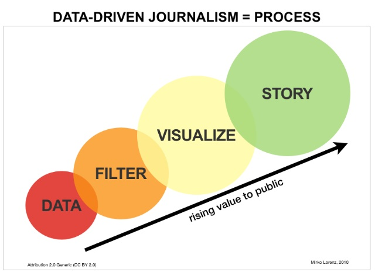
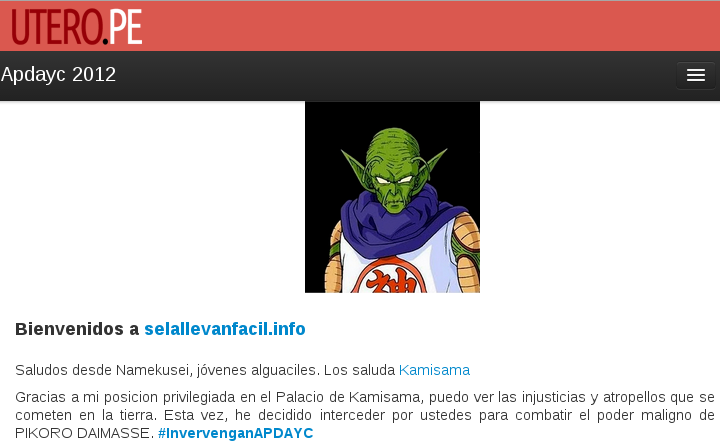

# Periodismo de Datos. Capítulo 12

Y el Curso de Periodismo de Datos llega a su fin :-(

    > Todo tiene su final

En el [capítulo anterior](http://aniversarioperu.utero.pe/2014/03/04/periodismo-de-datos-capitulo-11/)
de este curso había hecho un rápido recuento de los principales hitos en este curso que ha durado poco
más de 12 semanas ([narcoindultos](http://aniversarioperu.utero.pe/2013/12/18/periodismo-de-datos-capitulo-02/) y
[mociones de saluditos congresales](http://aniversarioperu.utero.pe/2014/02/01/periodismo-de-datos-capitulo-07/)).

# El reportaje del diario La Nación (Argentina) como ejemplo
Para aprender hay guiarse de los mejores. Para este curso tomé como modelo el
reportaje ganador de periodismo de datos (2013) del diario la Nación. Este
equipo procesó miles de archivos PDF conteniendo gastos del senado para descubrir
"pérdida de fondos" debido a viajes ficticios de sus congresistas. Cobraban
pasajes y viáticos pero nunca viajaban.

<iframe width="560" height="315" src="//www.youtube.com/embed/qEZ2xMwPMWo" frameborder="0" allowfullscreen></iframe>

Por esta razón en este curso vimos algunas herramientas que te pueden ayudar a realizar este tipo de investigaciones
(ejemplo *grep*, *curl*, OCR, *Open Refine*).

## El caso de bases de datos
Muchas veces la información es tan compleja que no es suficiente tener los
datos en archivos, y se necesita almacenar todos los
datos en una [Base de Datos relacional](http://es.wikipedia.org/wiki/Base_de_datos_relacional).

Estas bases de datos cumplen la función de almacenar la información de manera
indexada y puede mantener conexiones entre datos provenientes de diferentes
fuentes de información. Ejemplos de estas bases de datos relacionales son los
populares MySQL, PostgreSQL, SQLite, etc.

Es con estas bases de datos que se pueden hacer maravillas en el manejo de
información, y son particularmente importantes en el sector del periodismo que
no he mencionado durante el curso: [*Data-driven journalism*](http://en.wikipedia.org/wiki/Data-driven_journalism).

Según la [rica Wikipedia](http://en.wikipedia.org/wiki/Data-driven_journalism), el *data-driven journalism* 
consiste en conseguir datos, filtrarlos, procesarlos, y presentarlos de manera visual para poder
crear una historia. La parte clave es la visualización de los datos que se crea
a manera de servicio al público, consumidores, administradores, políticos con
el fin entender patrones y promover la discusión de proyectos de ley, políticas de gobierno y
demás.

O sea es lo mismo que hemos estado haciendo en este curso con la adición de
una manera de *visualizar* los datos. 

Por lo general esta
visualización se hace fabricando una aplicación web que se encargue de producir
páginas en HTML para el público y haya una base de datos relacional detrás que
suministre los datos cuando sea necesario.

Un buen ejemplo de este tipo de periodismo es la magnífica aplicación
uterina ["Se la llevan fácil"](http://utero.pe/selallevan/), creada por
[@kamisama_psmc](https://twitter.com/kamisama_psmc) que contiene 
información pública de los reportes financieros de APDAYC (2012). El objetivo
es hacer que el público se interese en el caso #intervenganAPDAYC y puedan
examinar por su cuenta los datos usando una interfaz amigable con
herramientas como el "versus" de APDAYC. Este "versus" consiste en comparar
las ganancias por regalías de dos compositores y ver de una manera gráfica las
posibles inconsistencias entre las ganancias de un músico súper exitoso
versus otro que no lo sea. 

Para crear este tipo de aplicaciones es necesario saber programar la
interfaz. Además que las bases de datos relacionales como MySQL se pueden
acceder de manera más eficiente creado *software* en algún lenguaje de
programación como PHP, Python o Ruby (los más populares).

# Cómo aprender a crear este tipo de aplicaciones
Si bien en recursos gratuitos como [CodeAcademy](http://www.codecademy.com/es) 
puedes aprender los
fundamentos de programación en tu lenguaje favorito, es necesario además 
aprender a desarrollar aplicaciones web usando algún *framework* como Django,
         Ruby on Rails, PHPCake, etc. Estos frameworks se
encargan de realizar las conexiones entre usuarios, base de datos relacional y
el software necesario para generar la aplicación web.

Un curso online excelente para aprender el framework Ruby On Rails está
disponible en <https://onemonth.com/courses/>. Este curso consiste en una serie
de vídeos que explican desde lo más básico (preparar tu computadora para
        comenzar a programar, *version-control* usando Git) hasta cosas
complicadas como crear un clon de Pinterest. He llevado este curso y me
parece muy bueno para iniciarse en el desarrollo de aplicaciones web con fines
de *data-driven journalism*. Lo malo es que el curso no es gratuito. Cuesta 99
dólares, pero es una excelente inversión.

# Entrega de certificados
Tal como se dijo al comienzo, este curso es gratuito pero la entrega de
certificados tiene un costo por gastos administrativos.
Se entregará certificados a nombre del Blog Útero de Marita siempre y cuando
cumplas con dos condiciones:

* Examen final: que consiste en la entrega por email de la solución a las tareas de este curso. Máximo 1 hoja
  A4.
* **Depósito de 86 nuevos soles** (aprox. 30$) a la cuenta bancaria de la producción del blog en
  el Banco BCP (te doy la cuenta por inbox cuando envíes el examen final).

# TL;DR
Fin de curso.
